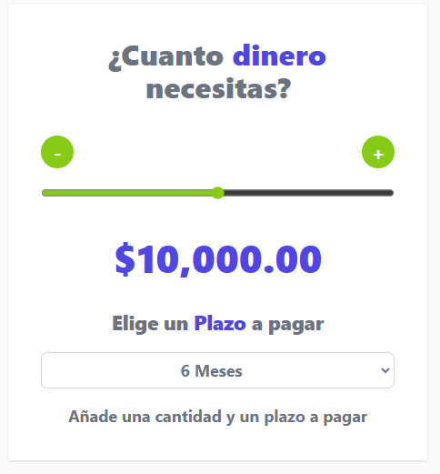

<h1>Cotizador Prestamos Vue  🏦💰</h1>

## Descripción 
El proyecto es un cotizador de préstamos desarrollado con Vue y Vite. Permite a los usuarios seleccionar un rango de préstamos desde 0 hasta 20000 USD, así como elegir la duración en meses, con opciones de 6, 12 y 24 meses. Con base en estos datos, el sistema calcula y muestra el total a pagar y el pago mensual correspondiente. El algoritmo aplicado considera que a mayor cantidad de dinero solicitada, los intereses son menores, y a menor plazo de pago, también se generan menos intereses. Esta herramienta brinda a los usuarios una estimación rápida y precisa de los costos asociados a un préstamo, permitiéndoles tomar decisiones informadas sobre sus finanzas personales.
## Autor ✒️
**Yechua Silva**

* [LinkedIn](https://www.linkedin.com/in/yechua-silva/)

## Ver ejemplo en vivo 
- [https://cotizador-prestamos-vue-yechua.netlify.app/](https://cotizador-prestamos-vue-yechua.netlify.app/)

## Instalación 
- Clone el repositorio en su maquina  
- Luego instale las dependencias en la carpeta del proyecto  
    <code> npm install </code>
- Con  <code> npm run dev </code>  ejecuta el proyecto como dependecia de desarrollo en localhost
- Con  <code> npm run build </code>   mueve el proyecto para produccion
  
## Contratación
Si estás interesado en contratarme, puedes ponerte en contacto conmigo escribiendo a yechua-silva@outlook.cl para cualquier consulta o solicitud.
